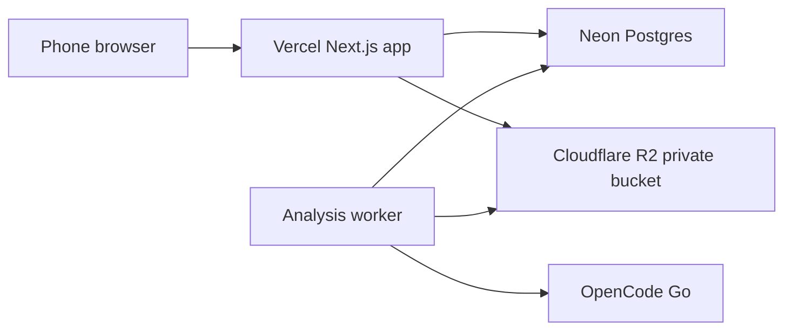

# Field Capture Beta

This beta adds a hosted manual-entry workflow for equipment inventory collection.
The deployed app is a Next.js App Router project in `web/`.

## Runtime Architecture



## Data Flow

1. User signs in with the beta passcode.
2. User creates an equipment entry and chooses/takes photos.
3. Browser asks the app for a short-lived R2 upload URL.
4. Browser uploads image bytes directly to R2.
5. App stores metadata, notes, and R2 object keys in Neon.
6. User taps `Analyze` for a photo.
7. App enqueues an `ai_analysis_jobs` row.
8. Worker claims queued jobs, fetches the private R2 image through a short-lived
   read URL, calls OpenCode Go, and stores structured JSON results in Neon.

## Environment Variables

Required for the web app and worker:

- `DATABASE_URL`
- `CLOUDFLARE_ACCOUNT_ID`
- `R2_BUCKET_NAME`
- `R2_ACCESS_KEY_ID`
- `R2_SECRET_ACCESS_KEY`
- `APP_PASSCODE_HASH`
- `APP_SESSION_SECRET`
- `AI_PROVIDER`
- `OPENCODE_API_KEY`
- `OPENCODE_GO_MODELS`
- `WORKER_SECRET`

Do not commit `.env.local`, Vercel auth files, R2 credentials, Neon URLs, or AI
provider keys.

## Neon Schema

Apply the schema from the web app directory:

```powershell
cd web
npm run db:push
```

Main tables:

- `assets`: manual equipment entries.
- `notes`: free-form field notes.
- `photos`: R2 object metadata.
- `ai_analysis_jobs`: queued/running/succeeded/failed analysis jobs and results.

## Worker Operations

Run locally against the local dev server:

```powershell
cd web
npm run worker:analyze
```

Run against production:

```powershell
cd web
$env:WORKER_BASE_URL="https://mesinventory.vercel.app"
npm run worker:analyze
```

The worker endpoint is:

```text
POST /api/worker/analyze?limit=3
Authorization: Bearer <WORKER_SECRET>
```

## Vision Model Fallback

The beta uses OpenCode Go. The current fallback list is:

```text
kimi-k2.6,kimi-k2.7-code,mimo-v2.5-pro,mimo-v2.5,minimax-m2.5
```

`kimi-k2.6` was verified against a test VFD photo and identified an
AutomationDirect DURApulse GS20 VFD with high confidence.

DeepSeek V4 models are vision-capable, but the OpenCode Go chat-completions
endpoint rejected the OpenAI-style `image_url` payload during testing. Keep
DeepSeek out of the default fallback chain until its required image payload shape
is confirmed.

## Deployment

The current beta is deployed to Vercel:

```text
https://mesinventory.vercel.app
```

After each Vercel deployment, include the stable alias and the generated
deployment host in R2 CORS if direct browser upload testing requires it.

## Verification Checklist

- `npm run lint`
- `npm run build`
- `npm run db:push`
- Upload a photo from the hosted app.
- Confirm metadata appears in Neon.
- Queue an analysis job from the app.
- Run `npm run worker:analyze`.
- Confirm result appears under the recent entry.
- Confirm tracked secret scan returns zero true secret matches.
